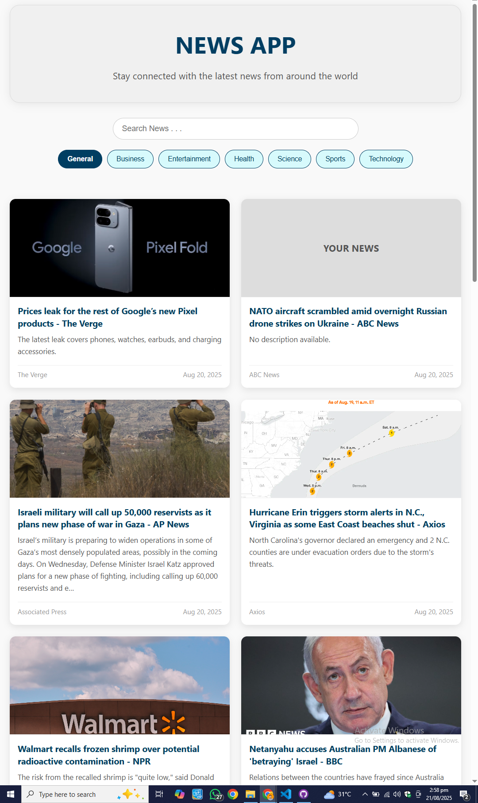
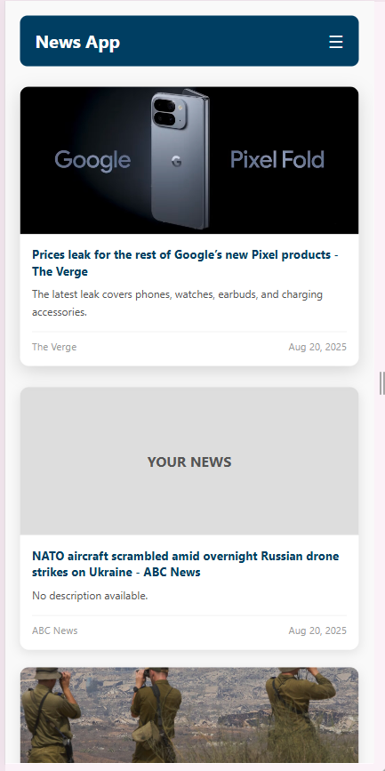
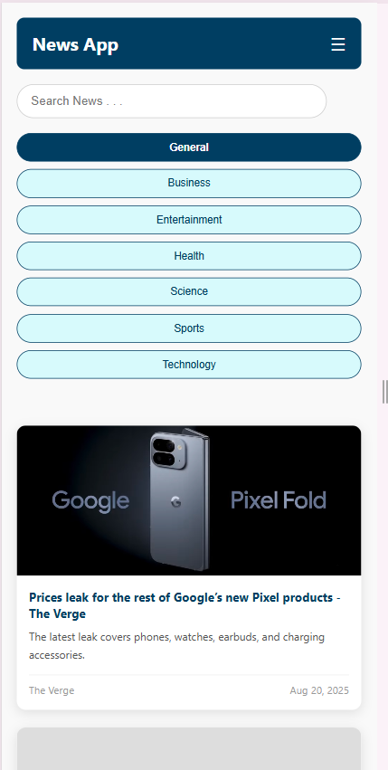

# 📰 NewsApp - Stay Connected

A responsive web-based news application that helps users stay updated with the latest headlines from around the world, categorized by topics like Business, Health, Technology, and more.

---

## 🚀 Features

- 🌐 Fetches live news (optional backend or API integration)  
- 🔍 Search functionality  
- 📱 Fully responsive: mobile-friendly with collapsible menu  
- 🗂️ Browse news by categories  
- 💅 Clean, modern UI using HTML5 + CSS3  

## 📸 Example Categories

- General
- Business
- Entertainment
- Health
- Science
- Sports
- Technology

✅ Responsive Design

Desktop View: Full header with search and category buttons.

Mobile View: Collapsible menu with ☰ toggle button.

